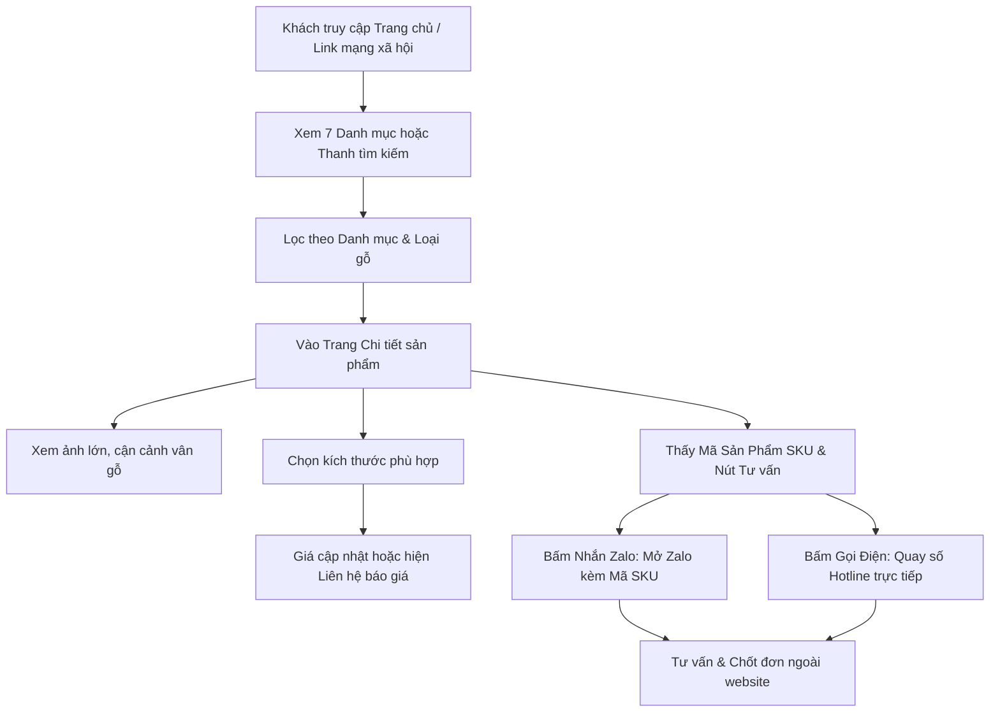
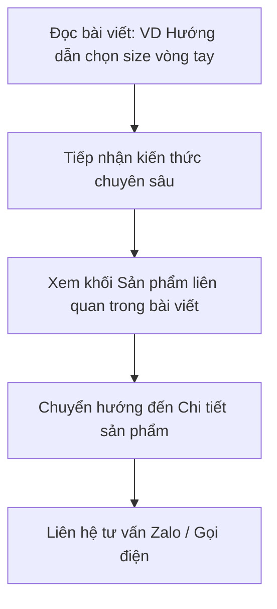
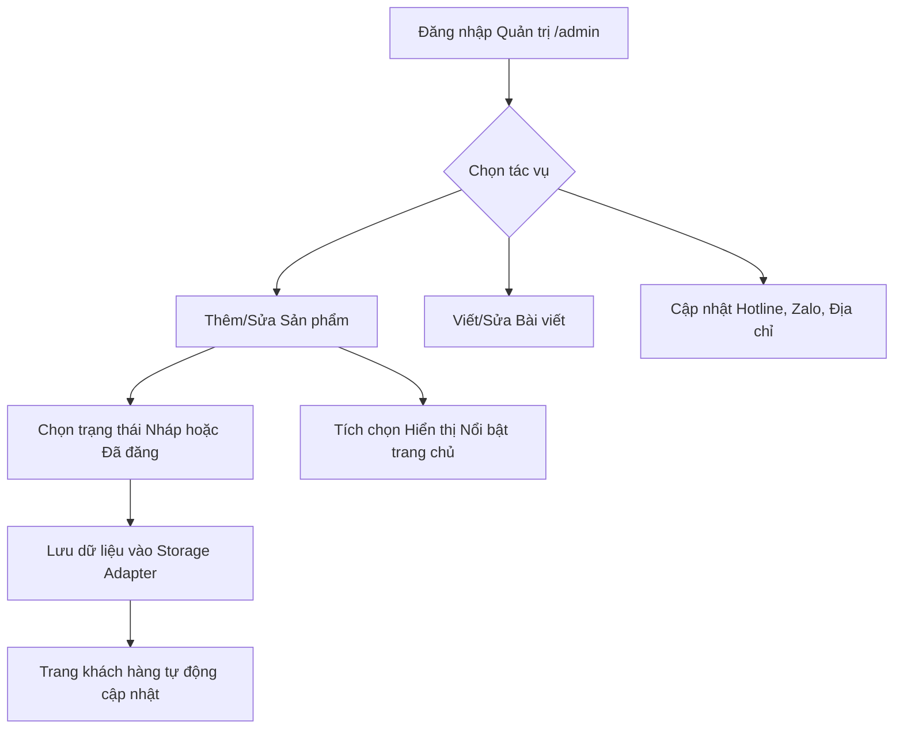

# Sơ đồ Website & Thiết kế Luồng Tương tác (User Flow)

Tài liệu này chi tiết hóa cấu trúc Sitemap và các luồng hành vi của người dùng trên website **Mỹ Nghệ Đông Phong**.

---

## 1. Cây Sơ đồ Trang (Sitemap Hierarchy)

```text
Trang chủ (/)
├── Danh mục & Sản phẩm (/san-pham)
│   ├── Vòng tay (/san-pham?danh-muc=vong-tay)
│   ├── Bút ký (/san-pham?danh-muc=but-ky)
│   ├── Bi lăn tay (/san-pham?danh-muc=bi-lan-tay)
│   ├── Gối gỗ (/san-pham?danh-muc=goi-go)
│   ├── Tẩu (/san-pham?danh-muc=tau)
│   ├── Đũa gỗ (/san-pham?danh-muc=dua-go)
│   ├── Đệm khoác ô tô (/san-pham?danh-muc=dem-khoac-oto)
│   └── Chi tiết từng sản phẩm (/san-pham/:id)
├── Giới thiệu (/gioi-thieu)
├── Bài viết (/bai-viet)
│   ├── Kiến thức về gỗ (/bai-viet?nhom=kien-thuc)
│   ├── Hướng dẫn lựa chọn (/bai-viet?nhom=huong-dan)
│   ├── Bảo quản sản phẩm (/bai-viet?nhom=bao-quan)
│   └── Chi tiết từng bài viết (/bai-viet/:id)
├── Liên hệ (/lien-he)
└── Quản trị hệ thống (/admin)
    ├── Quản lý Sản phẩm (Danh sách, Thêm mới, Sửa, Đổi trạng thái Nháp/Đăng, Nổi bật)
    ├── Quản lý Bài viết
    └── Cấu hình thông tin liên hệ (Hotline, Zalo, Địa chỉ)
```

---

## 2. Thiết kế Luồng Hành vi Khách hàng

### Luồng 1: Tìm kiếm, Tham khảo và Hỏi mua Sản phẩm


### Luồng 2: Đọc Bài viết Kiến thức và Khám phá Sản phẩm


### Luồng 3: Quản trị viên cập nhật Nội dung

